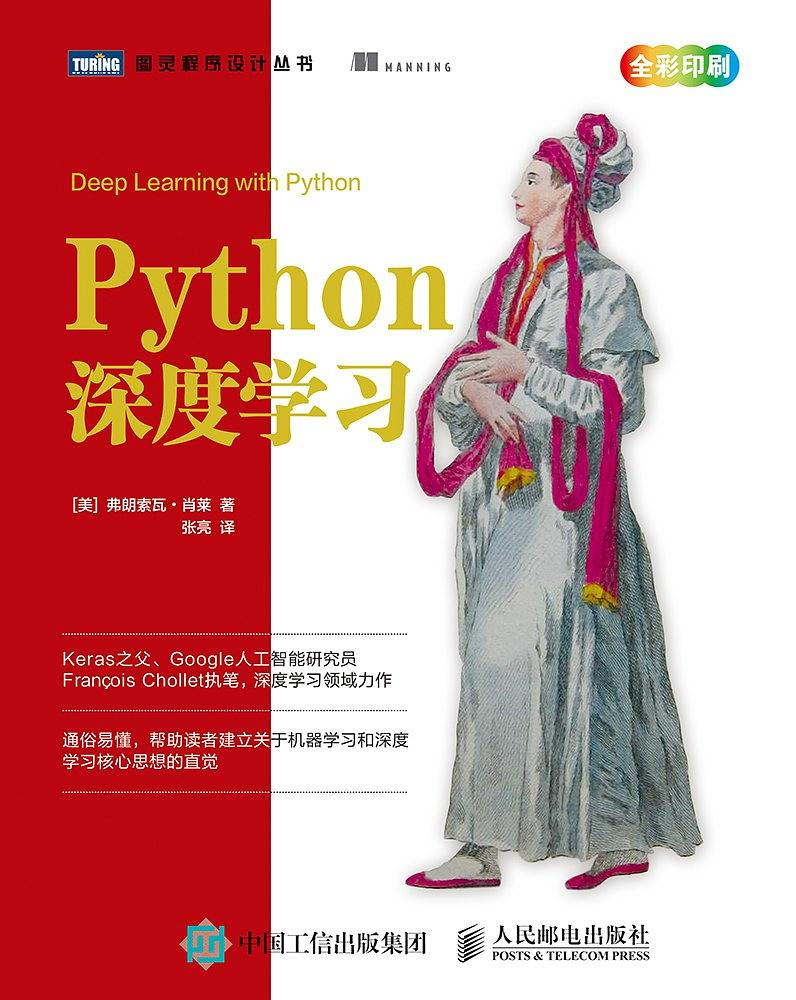

# Python深度学习 (Deep Learning with Python) #
## [美] 弗朗索瓦·肖莱（Francois Chollet） 著

# 项目说明 #

>目录下代码文件名前缀表示对应于 *Deep Learning with Python* 的中文译本
>《Python 深度学习》的相应章节，难度循序渐进。代码中使用中文注释。

>源代码可以参考官方Jupyter Notebook的[GitHub项目](https://github.com/fchollet/deep-learning-with-python-notebooks)

# 图书目录 #
## 第一部分　深度学习基础 ##

**第1章 什么是深度学习**　2

1.1　人工智能、机器学习与深度学习　2

1.1.1　人工智能　3

1.1.2　机器学习　3

1.1.3　从数据中学习表示　4

1.1.4　深度学习之“深度”　6

1.1.5　用三张图理解深度学习的工作原理　7

1.1.6　深度学习已经取得的进展　9

1.1.7　不要相信短期炒作　9

1.1.8　人工智能的未来　10

1.2　深度学习之前：机器学习简史　11

1.2.1　概率建模　11

1.2.2　早期神经网络　11

1.2.3　核方法　12

1.2.4　决策树、随机森林与梯度提升机　13

1.2.5　回到神经网络　14

1.2.6　深度学习有何不同　14

1.2.7　机器学习现状　15

1.3　为什么是深度学习，为什么是现在　15

1.3.1　硬件　16

1.3.2　数据　17

1.3.3　算法　17

1.3.4　新的投资热潮　17

1.3.5　深度学习的大众化　18

1.3.6　这种趋势会持续吗　18

**第2章 神经网络的数学基础**　20

2.1　初识神经网络　20

2.2　神经网络的数据表示　23

2.2.1　标量（0D张量）　23

2.2.2　向量（1D张量）　24

2.2.3　矩阵（2D张量）　24

2.2.4　3D张量与更高维张量　24

2.2.5　关键属性　25

2.2.6　在Numpy中操作张量　26

2.2.7　数据批量的概念　27

2.2.8　现实世界中的数据张量　27

2.2.9　向量数据　27

2.2.10　时间序列数据或序列数据　28

2.2.11　图像数据　28

2.2.12　视频数据　29

2.3　神经网络的“齿轮”：张量运算　29

2.3.1　逐元素运算　30

2.3.2　广播　31

2.3.3　张量点积　32

2.3.4　张量变形　34

2.3.5　张量运算的几何解释　34

2.3.6　深度学习的几何解释　35

2.4　神经网络的“引擎”：基于梯度的优化　36

2.4.1　什么是导数　37

2.4.2　张量运算的导数：梯度　38

2.4.3　随机梯度下降　38

2.4.4　链式求导：反向传播算法　41

2.5　回顾第 一个例子　41

本章小结　42

**第3章　神经网络入门**　43

3.1　神经网络剖析　43

3.1.1　层：深度学习的基础组件　44

3.1.2　模型：层构成的网络　45

3.1.3　损失函数与优化器：配置学习过程的关键　45

3.2　Keras简介　46

3.2.1　Keras、TensorFlow、Theano 和CNTK　47

3.2.2　使用Keras 开发：概述　48

3.3　建立深度学习工作站　49

3.3.1　Jupyter笔记本：运行深度学习实验的首选方法　49

3.3.2　运行Keras：两种选择　50

3.3.3　在云端运行深度学习任务：优点和缺点　50

3.3.4　深度学习的最佳GPU　50

3.4　电影评论分类：二分类问题　51

3.4.1　IMDB 数据集　51

3.4.2　准备数据　52

3.4.3　构建网络　52

3.4.4　验证你的方法　56

3.4.5　使用训练好的网络在新数据上生成预测结果　59

3.4.6　进一步的实验　59

3.4.7　小结　59

3.5　新闻分类：多分类问题　59

3.5.1　路透社数据集　60

3.5.2　准备数据　61

3.5.3　构建网络　61

3.5.4　验证你的方法　62

3.5.5　在新数据上生成预测结果　65

3.5.6　处理标签和损失的另一种方法　65

3.5.7　中间层维度足够大的重要性　65

3.5.8　进一步的实验　66

3.5.9　小结　66

3.6　预测房价：回归问题　66

3.6.1　波士顿房价数据集　67

3.6.2　准备数据　67

3.6.3　构建网络　68

3.6.4　利用K折验证来验证你的方法　68

3.6.5　小结　72

本章小结　73

**第4章　机器学习基础**　74

4.1　机器学习的四个分支　74

4.1.1　监督学习　74

4.1.2　无监督学习　75

4.1.3　自监督学习　75

4.1.4　强化学习　75

4.2　评估机器学习模型　76

4.2.1　训练集、验证集和测试集　77

4.2.2　评估模型的注意事项　80

4.3　数据预处理、特征工程和特征学习　80

4.3.1　神经网络的数据预处理　80

4.3.2　特征工程　81

4.4　过拟合与欠拟合　83

4.4.1　减小网络大小　83

4.4.2　添加权重正则化　85

4.4.3　添加dropout正则化　87

4.5　机器学习的通用工作流程　89

4.5.1　定义问题，收集数据集　89

4.5.2　选择衡量成功的指标　89

4.5.3　确定评估方法　90

4.5.4　准备数据　90

4.5.5　开发比基准更好的模型　90

4.5.6　扩大模型规模：开发过拟合的模型　91

4.5.7　模型正则化与调节超参数　92

本章小结　92

## 第二部分　深度学习实践 ##

**第5章　深度学习用于计算机视觉**　94

5.1　卷积神经网络简介　94

5.1.1　卷积运算　96

5.1.2　最大池化运算　101

5.2　在小型数据集上从头开始训练一个卷积神经网络　102

5.2.1　深度学习与小数据问题的相关性　103

5.2.2　下载数据　103

5.2.3　构建网络　106

5.2.4　数据预处理　107

5.2.5　使用数据增强　111

5.3　使用预训练的卷积神经网络　115

5.3.1　特征提取　116

5.3.2　微调模型　124

5.3.3　小结　130

5.4　卷积神经网络的可视化　130

5.4.1　可视化中间激活　131

5.4.2　可视化卷积神经网络的过滤器　136

5.4.3　可视化类激活的热力图　142

本章小结　146

**第6章　深度学习用于文本和序列**　147

6.1　处理文本数据　147

6.1.1　单词和字符的one-hot编码　149

6.1.2　使用词嵌入　151

6.1.3　整合在一起：从原始文本到词嵌入　155

6.1.4　小结　162

6.2　理解循环神经网络　162

6.2.1　Keras中的循环层　164

6.2.2　理解LSTM层和GRU层　168

6.2.3　Keras中一个LSTM的具体例子　170

6.2.4　小结　172

6.3　循环神经网络的高级用法　172

6.3.1　温度预测问题　172

6.3.2　准备数据　175

6.3.3　一种基于常识的、非机器学习的基准方法　177

6.3.4　一种基本的机器学习方法　178

6.3.5　第 一个循环网络基准　180

6.3.6　使用循环dropout来降低过拟合　181

6.3.7　循环层堆叠　182

6.3.8　使用双向RNN　184

6.3.9　更多尝试　187

6.3.10　小结　187

6.4　用卷积神经网络处理序列　188

6.4.1　理解序列数据的一维卷积　188

6.4.2　序列数据的一维池化　189

6.4.3　实现一维卷积神经网络　189

6.4.4　结合CNN和RNN来处理长序列　191

6.4.5　小结　195

本章总结　195

**第7章　高级的深度学习最佳实践**　196

7.1　不用Sequential模型的解决方案：Keras 函数式API　196

7.1.1　函数式API简介　199

7.1.2　多输入模型　200

7.1.3　多输出模型　202

7.1.4　层组成的有向无环图　204

7.1.5　共享层权重　208

7.1.6　将模型作为层　208

7.1.7　小结　209

7.2　使用Keras回调函数和TensorBoard来检查并监控深度学习模型　210

7.2.1　训练过程中将回调函数作用于模型　210

7.2.2　TensorBoard简介：TensorFlow的可视化框架　212

7.2.3　小结　219

7.3　让模型性能发挥到极致　219

7.3.1　高级架构模式　219

7.3.2　超参数优化　222

7.3.3　模型集成　223

7.3.4　小结　224

本章总结　225

**第8章　生成式深度学习**　226

8.1　使用LSTM生成文本　227

8.1.1　生成式循环网络简史　227

8.1.2　如何生成序列数据　228

8.1.3　采样策略的重要性　229

8.1.4　实现字符级的LSTM文本生成　230

8.1.5　小结　234

8.2　DeepDream　235

8.2.1　用Keras实现DeepDream　236

8.2.2　小结　241

8.3　神经风格迁移　241

8.3.1　内容损失　242

8.3.2　风格损失　243

8.3.3　用Keras实现神经风格迁移　243

8.3.4　小结　249

8.4　用变分自编码器生成图像　249

8.4.1　从图像的潜在空间中采样　249

8.4.2　图像编辑的概念向量　250

8.4.3　变分自编码器　251

8.4.4　小结　256

8.5　生成式对抗网络简介　257

8.5.1　GAN 的简要实现流程　258

8.5.2　大量技巧　259

8.5.3　生成器　260

8.5.4　判别器　261

8.5.5　对抗网络　261

8.5.6　如何训练DCGAN　262

8.5.7　小结　264

本章总结　264

**第9章　总结**　265

9.1　重点内容回顾　265

9.1.1　人工智能的各种方法　265

9.1.2　深度学习在机器学习领域中的特殊之处　266

9.1.3　如何看待深度学习　266

9.1.4　关键的推动技术　267

9.1.5　机器学习的通用工作流程　268

9.1.6　关键网络架构　268

9.1.7　可能性空间　272

9.2　深度学习的局限性　273

9.2.1　将机器学习模型拟人化的风险　273

9.2.2　局部泛化与极端泛化　275

9.2.3　小结　276

9.3　深度学习的未来　277

9.3.1　模型即程序　277

9.3.2　超越反向传播和可微层　278

9.3.3　自动化机器学习　279

9.3.4　终身学习与模块化子程序复用　279

9.3.5　长期愿景　281

9.4　了解一个快速发展领域的最新进展　281

9.4.1　使用Kaggle练习解决现实世界的问题　281

9.4.2　在arXiv阅读最新进展　282

9.4.3　探索Keras生态系统　282

9.5　结束语　282

**附录A　在Ubuntu上安装Keras及其依赖**　283

**附录B　在EC2 GPU实例上运行Jupyter笔记本**　287

